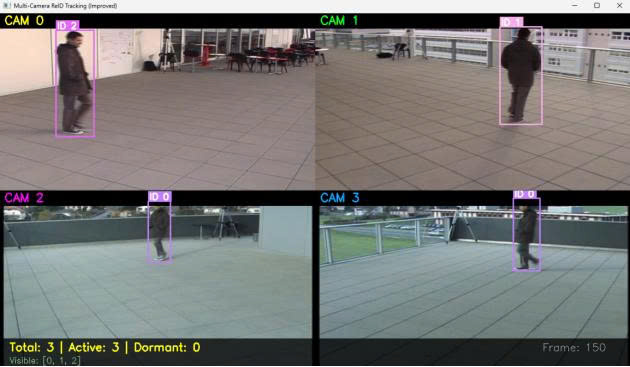
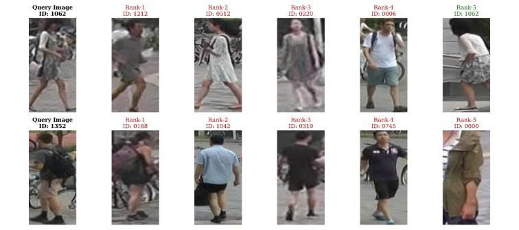
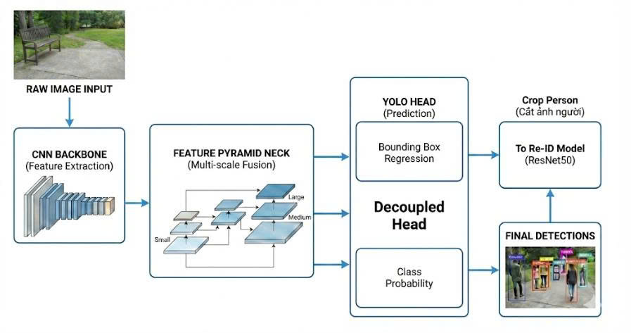

<div align="center">

# Person Re-Identification & Multi-Object Tracking

### Hệ thống phát hiện, theo dõi và định danh người trong video

Dự án kết hợp **YOLOv8, ByteTrack và ResNet50 ReID** để duy trì Global ID ổn định cho từng người trong video, kể cả khi đối tượng bị che khuất hoặc xuất hiện trở lại.

[Demo](#demo) · [Kiến trúc](#kiến-trúc-hệ-thống) · [Dữ liệu](#dữ-liệu) · [Cài đặt](#cài-đặt) · [Chạy suy luận](#chạy-suy-luận) · [Hướng phát triển](#hướng-phát-triển)

<br>


</div>

---

## Tổng quan

Dự án xây dựng hệ thống **Multi-Object Tracking kết hợp Person Re-Identification** nhằm:

- Phát hiện người trong từng frame
- Theo dõi nhiều đối tượng cùng lúc
- Duy trì ID ổn định trong toàn bộ video
- Nhận diện lại người đã rời khỏi khung hình và xuất hiện trở lại
- Lưu ảnh crop theo từng Global ID
- Xuất video kết quả và metadata chi tiết

Pipeline tổng quát:

```text
Video
  ↓
YOLOv8 Person Detection
  ↓
ByteTrack Multi-Object Tracking
  ↓
ResNet50 ReID Feature Extraction
  ↓
Cosine Distance + Hungarian Matching
  ↓
Global Person ID
```

---

## Demo

<div align="center">




</div>

### Multi-Camera Tracking

Ảnh bên trái minh họa hệ thống theo dõi người trên nhiều camera và duy trì ID giữa các góc nhìn khác nhau.

### Person Re-Identification

Ảnh bên phải minh họa kết quả truy vấn ReID, trong đó một ảnh query được so sánh với các ảnh trong gallery và trả về danh sách Top-K gần nhất.

> Có thể bổ sung thêm video hoặc GIF demo:

```markdown

```

Hoặc liên kết trực tiếp đến video kết quả:

```markdown
[▶ Xem video kết quả](result/tracked_video_final.mp4)
```

---

## Tính năng chính

- Phát hiện người bằng YOLOv8
- Theo dõi nhiều người bằng ByteTrack
- Trích xuất embedding ReID bằng ResNet50
- Gán Global ID ổn định
- Matching bằng IoU và cosine distance
- Tối ưu assignment bằng Hungarian Algorithm
- Quản lý trạng thái Tentative, Confirmed và Deleted
- Lưu lịch sử feature theo từng track
- Exponential Moving Average cho ReID features
- Lưu ảnh crop chất lượng cao theo từng ID
- Xuất video tracking
- Xuất metadata JSON
- Hỗ trợ đánh giá Rank-1, mAP và cosine distance distribution

---

## Kiến trúc hệ thống

```text
Input Video
    ↓
Frame Extraction
    ↓
YOLOv8 Detector
    ↓
Person Bounding Boxes
    ↓
ByteTrack
    ↓
Track State Management
    ├── Tentative
    ├── Confirmed
    └── Deleted
    ↓
ResNet50 ReID
    ↓
L2-normalized Embeddings
    ↓
IoU + Cosine Cost Matrix
    ↓
Hungarian Assignment
    ↓
Global ID Manager
    ↓
Tracked Video + JSON Metadata + Person Crops
```


### Pipeline huấn luyện hai mô hình

<div align="center">




</div>

#### Pipeline 1 — Huấn luyện YOLOv8 Person Detection

Pipeline này mô tả quá trình chuẩn bị dữ liệu MOT17, chuyển đổi annotation, cấu hình dataset, huấn luyện YOLOv8 và đánh giá mô hình phát hiện người.

```text
MOT17 Dataset
    ↓
Lọc pedestrian và bounding box hợp lệ
    ↓
Chuyển annotation sang định dạng YOLO
    ↓
Chia train / validation
    ↓
Huấn luyện YOLOv8
    ↓
Đánh giá Precision, Recall và mAP
    ↓
Xuất detection checkpoint
```

#### Pipeline 2 — Huấn luyện ResNet50 Person ReID

Pipeline này mô tả quá trình kết hợp Market-1501 và DukeMTMC, chuẩn hóa Person ID, huấn luyện ResNet50 bằng Classification Loss và Triplet Loss, sau đó đánh giá bằng Rank-1 và mAP.

```text
Market-1501 + DukeMTMC
    ↓
Làm sạch và remap Person ID
    ↓
Chia train / validation / query / gallery
    ↓
Resize ảnh về 256 × 128
    ↓
ResNet50 Feature Extractor
    ↓
Cross-Entropy Loss + Triplet Loss
    ↓
L2-normalized Embedding
    ↓
Đánh giá Rank-1 và mAP
    ↓
Xuất ReID checkpoint
```

---

## Cơ chế Tracker

### Trạng thái track

| Trạng thái | Điều kiện |
|---|---|
| Tentative | Track mới, số lần match nhỏ hơn `n_init` |
| Confirmed | Track đã được xác nhận sau đủ số lần match |
| Deleted | Track không được cập nhật quá `max_age` frame |

### Ma trận chi phí

#### Track Tentative

```text
Cost = 0.7 × IoU Distance + 0.3 × Cosine Distance
```

#### Track Confirmed có overlap

```text
Cost = 0.3 × IoU Distance + 0.7 × Cosine Distance
```

#### Track Confirmed không overlap

```text
Cost = Cosine Distance
```

### Cấu hình mặc định

| Tham số | Giá trị |
|---|---:|
| Max cosine distance | 0.4 |
| Max IoU distance | 0.7 |
| Max age | 30 frames |
| N-init | 3 frames |
| Minimum confidence | 0.5 |

---

## Mô hình ReID

### Kiến trúc

- Backbone: ResNet50 pretrained trên ImageNet
- Last stride: 1
- Input size: 256 × 128
- Output: vector đặc trưng đã L2 normalization

### Loss functions

- Cross-Entropy Loss
- Triplet Loss

### Quản lý feature

- Exponential Moving Average
- Tối đa 50 features cho mỗi track
- Ưu tiên các feature gần nhất
- Chuẩn hóa L2 trước khi matching

---

## Dữ liệu

### Person Re-Identification

Dự án kết hợp:

- Market-1501
- DukeMTMC

Quy trình xử lý:

- Loại ảnh nhiễu có `pid = -1` hoặc `0000`
- Loại ảnh có kích thước nhỏ hơn 32 px
- Remap ID giữa các dataset
- Chia train, validation, query và gallery

| Tập dữ liệu | Số lượng |
|---|---:|
| Train | 26.512 ảnh |
| Validation | 2.946 ảnh |
| Query | 3.368 ảnh |
| Gallery | 19.732 ảnh |

### Person Detection

Sử dụng MOT17 với các điều kiện:

- Chỉ giữ pedestrian
- Visibility từ 0.2 trở lên
- Bounding box width từ 10 px trở lên
- Sử dụng SDP sequences

Tổng số frame train và validation:

```text
5.316 frames
```

---

## Tối ưu hiệu năng

### ReID extraction

- Trích xuất feature mỗi 3 frame
- Batch size: 8 crops
- Cập nhật feature mỗi 10 frame

### Video processing

- Ưu tiên codec H264 hoặc AVC1
- Fallback sang MP4V hoặc XVID
- Hỗ trợ re-encode bằng FFmpeg
- Có thể tắt display để tăng tốc

### Lưu ảnh crop

- Lưu mỗi 10 frame trên mỗi track
- Chỉ lưu crop có chất lượng từ 0.5
- Sắp xếp ảnh theo từng Global ID

```text
person_crops/
├── ID_001/
│   ├── frame_000120_conf_0.93.jpg
│   └── frame_000130_conf_0.95.jpg
└── ID_002/
```

---

## Kết quả thực nghiệm

<div align="center">


</div>

Hệ thống được đánh giá trên hai nhóm nhiệm vụ chính:

1. **Person Detection** bằng YOLOv8  
2. **Person Re-Identification** bằng ResNet50 ReID

### Kết quả Person Re-Identification

| Chỉ số | Kết quả | Ý nghĩa |
|---|---:|---|
| Validation Accuracy | **96,91%** | Độ chính xác phân loại trên tập validation nội bộ |
| Rank-1 Accuracy | **78,65%** | Tỷ lệ ảnh đúng xuất hiện ở vị trí đầu tiên trong kết quả truy vấn |
| mAP ReID | **54,11%** | Độ bao phủ trung bình của các ảnh cùng ID trong toàn bộ gallery |

### Kết quả Person Detection

Ma trận nhầm lẫn chuẩn hóa của YOLOv8 cho thấy:

| Nhãn thực tế | Dự đoán đúng | Dự đoán sai |
|---|---:|---:|
| Person | **95%** | 5% bị dự đoán thành Background |
| Background | **92%** | 8% bị dự đoán thành Person |

### Nhận xét

- YOLOv8 nhận diện người tốt với tỷ lệ dự đoán đúng khoảng **95%** trên lớp Person.
- Tỷ lệ Background được phân loại đúng đạt khoảng **92%**.
- Validation Accuracy của mô hình ReID đạt **96,91%**, cho thấy mô hình học tốt trên tập validation.
- Rank-1 Accuracy đạt **78,65%**, nghĩa là trong phần lớn truy vấn, ảnh đúng ID xuất hiện ngay ở vị trí đầu tiên.
- mAP đạt **54,11%**, cho thấy mô hình đã truy xuất được nhiều ảnh cùng ID trong gallery nhưng vẫn còn dư địa cải thiện.
- Sai số còn lại có thể đến từ che khuất, góc nhìn khác biệt, độ phân giải thấp, trang phục tương tự và chất lượng bounding box.

### Ý nghĩa đối với pipeline tổng thể

Kết quả detection tốt giúp ByteTrack nhận được bounding box ổn định hơn. Trong khi đó, kết quả ReID giúp hệ thống gán lại Global ID khi đối tượng:

- Bị che khuất tạm thời
- Rời khỏi khung hình
- Xuất hiện lại sau một khoảng thời gian
- Xuất hiện ở camera khác

Tuy nhiên, hiệu quả cuối cùng của hệ thống vẫn phụ thuộc vào sự kết hợp giữa detection, tracking, feature extraction và matching threshold.

---

## Công nghệ sử dụng

| Thành phần | Công nghệ |
|---|---|
| Ngôn ngữ | Python |
| Deep Learning | PyTorch, TorchVision |
| Object Detection | Ultralytics YOLOv8 |
| Multi-Object Tracking | ByteTrack |
| Person ReID | ResNet50 |
| Assignment | SciPy Hungarian Algorithm |
| Matching | IoU, cosine similarity |
| Video Processing | OpenCV, FFmpeg |
| Data Processing | NumPy, Pandas |
| Evaluation | Scikit-learn, Matplotlib |
| Configuration | YAML |
| Utilities | tqdm, psutil, lapx |

---

## Cấu trúc dự án

```text
Reid_people/
├── config/               # File cấu hình
├── logs/                 # Training và inference logs
├── result/               # Video, metadata và ảnh crop
├── scripts/              # Script hỗ trợ xử lý dữ liệu
├── src/                  # Core tracking và ReID modules
├── evaluate_reid.py      # Đánh giá model ReID
├── inference.py          # Chạy tracking và ReID trên video
├── train_reid.py         # Huấn luyện model ReID
├── train_yolo.py         # Huấn luyện YOLOv8
├── utils.py              # Hàm tiện ích
├── requirements.txt
├── structure.txt
├── z7927830379848_24ceee938c5a2c5b2736d18682641da8.jpg
├── z7927830379849_d22012390dde75cbcdd4492529355a44.jpg
├── pipeline.jpg
├── pipeiln 2.jpg
├── image(36).png
└── README.md
```

---

## Cài đặt

### 1. Clone repository

```bash
git clone https://github.com/vanujiash9/Reid_people.git
cd Reid_people
```

### 2. Tạo môi trường ảo

```bash
python -m venv .venv
```

Windows:

```bash
.venv\Scripts\activate
```

Linux hoặc macOS:

```bash
source .venv/bin/activate
```

### 3. Cài đặt thư viện

```bash
python -m pip install --upgrade pip
pip install -r requirements.txt
```

### 4. Cài FFmpeg

FFmpeg được khuyến nghị để xử lý codec và re-encode video.

Kiểm tra:

```bash
ffmpeg -version
```

---

## Huấn luyện YOLOv8

```bash
python train_yolo.py
```

Trước khi chạy, kiểm tra:

- Đường dẫn dataset MOT17
- File YAML dataset
- Cấu hình epochs
- Batch size
- Image size
- Output directory

---

## Huấn luyện ReID

```bash
python train_reid.py
```

Model sử dụng:

- ResNet50 backbone
- Cross-Entropy Loss
- Triplet Loss
- Input 256 × 128

---

## Đánh giá ReID

```bash
python evaluate_reid.py
```

Các metric chính:

- Rank-1 Accuracy
- mAP
- Cosine Distance Distribution

---

## Chạy suy luận

```bash
python inference.py
```

Trước khi chạy, cập nhật:

- Đường dẫn video đầu vào
- YOLO checkpoint
- ReID checkpoint
- Output directory
- Thresholds
- Tracker configuration

---

## Kết quả đầu ra

```text
result/
├── tracked_video_final.mp4
├── tracking_metadata.json
└── person_crops/
    ├── ID_001/
    ├── ID_002/
    └── ...
```

### Metadata JSON

File metadata có thể chứa:

- Độ phân giải video
- FPS
- Tổng số frame
- Thời gian xử lý
- Tổng số Global ID
- Số active tracks
- Số confirmed tracks
- First frame và last frame của từng người
- Tổng số frame xuất hiện
- Danh sách crop đã lưu

---

## Ví dụ ứng dụng

- Giám sát an ninh
- Phân tích đám đông
- Theo dõi khách hàng trong cửa hàng
- Retail analytics
- Video analytics
- Nghiên cứu Multi-Object Tracking
- Nghiên cứu Person Re-Identification

---

## Điểm nổi bật kỹ thuật

- Kết hợp detection, tracking và ReID trong cùng một pipeline
- Thiết kế track state machine
- Kết hợp IoU và cosine distance theo trạng thái track
- Hungarian Algorithm để matching tối ưu
- Exponential Moving Average cho feature history
- Hỗ trợ Global ID
- Tối ưu ReID bằng frame skipping và batch processing
- Xuất cả video, JSON metadata và ảnh crop
- Huấn luyện riêng YOLO và ReID model
- Hỗ trợ đánh giá Rank-1 và mAP

---

## Hạn chế hiện tại

- Hiệu quả ReID giảm khi khuôn mặt hoặc cơ thể bị che khuất mạnh
- Global ID có thể bị đổi trong cảnh quá đông
- Matching phụ thuộc nhiều vào chất lượng detection
- Chưa có camera calibration
- Chưa hỗ trợ cross-camera ReID hoàn chỉnh
- Chưa có giao diện web
- Chưa có Dockerfile
- Chưa có automated tests
- Chưa công bố đầy đủ benchmark cuối cùng trong README

---

## Hướng phát triển

- [ ] Bổ sung demo GIF hoặc video
- [ ] Công bố Rank-1 và mAP cuối cùng
- [ ] Bổ sung tracking metrics như MOTA, IDF1 và HOTA
- [ ] Hỗ trợ cross-camera ReID
- [ ] Tối ưu inference bằng ONNX hoặc TensorRT
- [ ] Thêm FastAPI backend
- [ ] Xây dựng giao diện web
- [ ] Docker hóa ứng dụng
- [ ] Thêm unit test và integration test
- [ ] Thêm model download link
- [ ] Cải thiện occlusion handling
- [ ] Thêm camera-aware matching

---

## Tác giả

**Bùi Thị Thanh Vân**

- GitHub: [@vanujiash9](https://github.com/vanujiash9)
- Email: thanh.van19062004@gmail.com

---

<div align="center">

Được xây dựng bằng **Python, PyTorch, YOLOv8, ByteTrack, ResNet50 và OpenCV**.

Nếu dự án hữu ích, hãy để lại một ⭐ để ủng hộ.

</div>

- Retail analytics
- Nghiên cứu MOT & ReID
